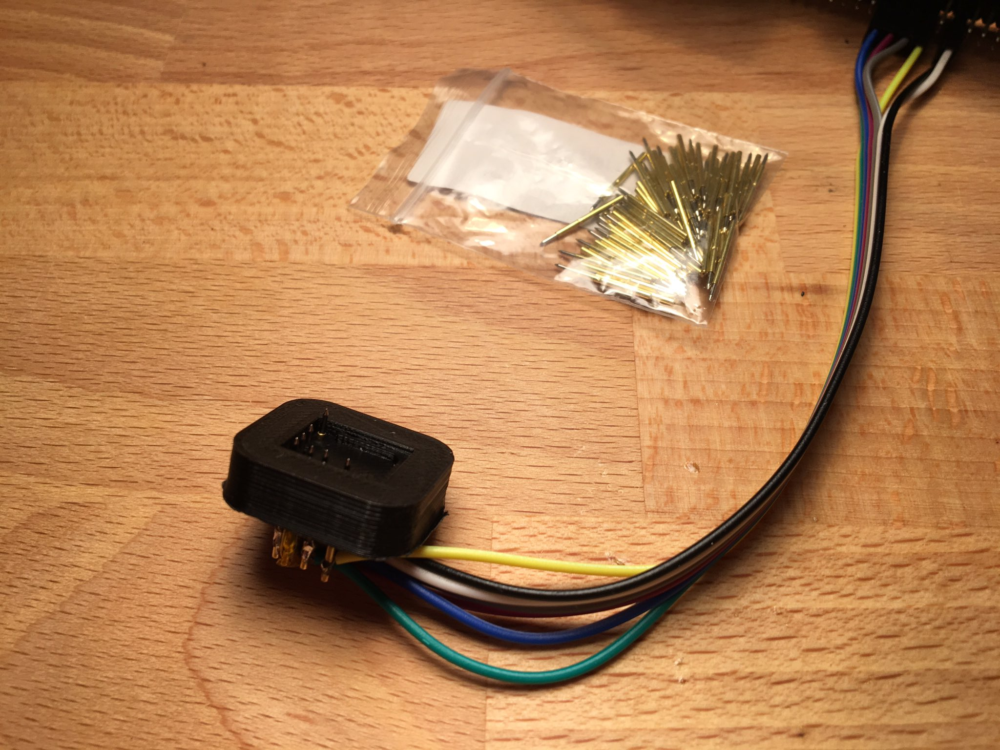

# Fomu 3d printed programming jig

## Introduction

This is a 3d printable programming jig for the Fomu Hacker V0.0 board, more information about it can be found here: https://www.crowdsupply.com/sutajio-kosagi/fomu

## Assumptions

This jig was made to provide an easier way to get the bootloader on the fomu hacker version. This version of the jig is not a 100% reliable, so while it should be possible to use this jig for development, for repeated programming it is recommended to have a look at the laser cuttable jig designed by Trammell Hudson: https://github.com/im-tomu/fomu-hardware/blob/master/hacker/fomu-jig.svg https://twitter.com/qrs/status/1084257262699536384 .

As there are many sizes and shapes of pogo pins you might have to adjust the size of the holes for your specific pins. The version in this repository was made with pogo pins with a largest diameter of 1mm, this resulted in a press fit. For smaller pins it might be better to glue them in, as small holes don't print well.

The model was made in fusion360, a step file is provided as well.

## Tools and parts needed
* A 3d printer
* pogo pins (the model assumes a largest diameter of 1mm)
* 7x 0.1" female to anything jumper wire
* Soldering equipment
* Kapton or other isolating tape
* Glue (optional)

## Instructions
Print the jig contained in the folder pogoPinVersion and test if your pogo pins fit. It can take a bit of force to get them in, but it should be possible without damaging the pin. If the pins do not go in at all, or get damaged, adjust the holes in the model. If the pins drop in without resistance you can also use glue at a later stage. Remove the pins again for the next step.

Strip the wires, wrap them around the pins and solder them.

The two pins next to the one in the corner are quite close to each other and the solder joints might touch. Wrap them in kapton tape to prevent this.

Press or glue the pins in the jig. The yellow part of the pogo pins should barely be visible in the cavety of the jig.

Connect the wires to your raspberry pi. The description of the letters on the fomu can be found here: https://github.com/im-tomu/fomu-hardware/tree/master/hacker and the pinout for the pi here: https://github.com/im-tomu/fomu-flash . Reset is CRESET. Note that the pin numbers that fomu-flash spits out from its help are the BCM pin numbers, see also https://pinout.xyz/#.

Press the Fomu in the jig and use fomu-flash -i to check if the it is seated in the jig correctly. If this is the case, it will report that it sees an adesto flash chip. Then use the other commands to load a bitstream on the flash. When releasing the fomu, be careful that it is very light and the pogo pins store quite a bit of energy.

## Licence and contributions
This programming jig is shared as CC-BY-SA 4.0. This jig was tested on an Ultimaker Classic and a Fomu hacker board V0.0. If it doesn't work on your setup i would be interested to know, as well as the things you tried fixing it. If you like this programming jig and want to contribute something back, please consider helping out in other parts of the Fomu project.